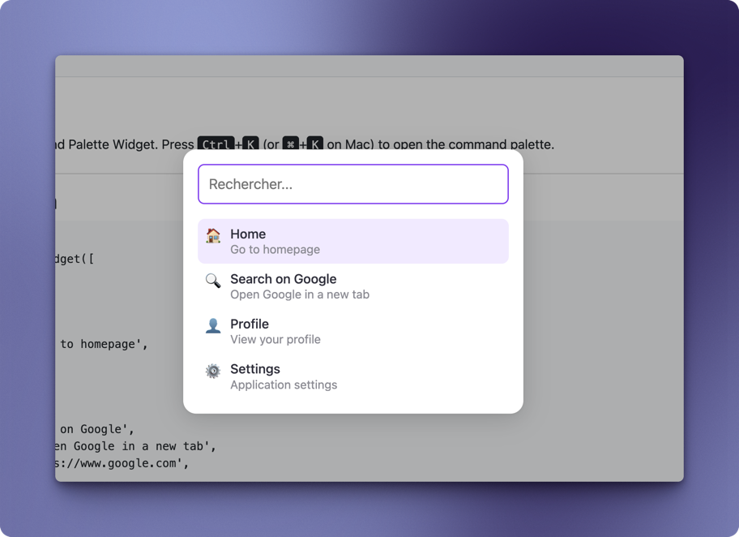

# Yii2 Command Palette Widget

A widget to add a command palette to your Yii2 application, similar to the ones in VSCode, GitHub, and other modern applications. The command palette provides a quick way to access commands and navigate through your application using keyboard shortcuts.



## Features

- 🚀 Keyboard-driven interface (Ctrl+K / Cmd+K to open)
- 🔍 Fuzzy search with Levenshtein distance algorithm
- ⌨️ Full keyboard navigation (arrow keys, enter, escape)
- 🎨 Customizable appearance
- 🧩 Multiple palettes on the same page
- 📱 Responsive design
- 🔗 Support for URLs and JavaScript actions
- 🖼️ Support for emoji and image icons

## Requirements

- PHP 8.0+
- Yii2 2.0+

## Installation

Install the package via Composer:

```bash
composer require eseperio/yii2-command-palette
```

## Basic Usage

```php
use eseperio\commandPalette\CommandPaletteWidget;

echo CommandPaletteWidget::widget([
    'items' => [
        [
            'icon' => '🏠',
            'name' => 'Home',
            'subtitle' => 'Go to homepage',
            'action' => '/',
        ],
        [
            'icon' => '🔍',
            'name' => 'Search',
            'subtitle' => 'Search for content',
            'action' => '/search',
        ],
        [
            'icon' => '⚙️',
            'name' => 'Settings',
            'subtitle' => 'Application settings',
            'action' => '/settings',
        ],
        [
            'icon' => 'https://example.com/icons/user.png',
            'name' => 'Profile',
            'subtitle' => 'View your profile',
            'action' => '/profile',
        ],
    ],
]);
```

## Item Configuration

Each item in the command palette can have the following properties:

- `icon` (string): An emoji or URL to an image
- `name` (string): The name of the item
- `subtitle` (string, optional): A subtitle or description
- `action` (string|callable): A URL or JavaScript function to execute when the item is selected

### URL Actions

You can specify a URL as the action, and the user will be redirected to that URL when the item is selected:

```php
'action' => '/profile', // Relative URL
'action' => 'https://example.com', // Absolute URL
```

### JavaScript Actions

You can specify a JavaScript function as the action using Yii2's JsExpression:

```php
use yii\web\JsExpression;

'action' => new JsExpression('function() { alert("Hello, world!"); }'),
```

Or use a more complex function:

```php
use yii\web\JsExpression;

'action' => new JsExpression('function() { 
    console.log("Item selected"); 
    window.location.href = "/profile"; 
}'),
```

This approach ensures that the JavaScript code is properly encoded and executed when the item is selected.

## Opening the Command Palette Programmatically

You can open the command palette programmatically using JavaScript:

```javascript
// Open the first command palette on the page
if (window.commandPalette_w0) {
    window.commandPalette_w0.open();
}
```

If you have multiple command palettes on the same page, you can access them using their widget IDs:

```javascript
// Open the second command palette on the page
if (window.commandPalette_w1) {
    window.commandPalette_w1.open();
}
```

## Customizing the Appearance

### Using CSS Variables

The command palette supports customization through CSS variables. You can set these variables in your own stylesheet to customize the appearance:

```css
/* Custom command palette styles using CSS variables */
:root {
  /* Primary colors */
  --cmdk-primary-color: #3b82f6;       /* Primary color (buttons, icons, focus) */
  --cmdk-background-color: #1e293b;    /* Background color of the panel */
  
  /* Element colors */
  --cmdk-element-title-color: #f8fafc;  /* Color of item titles */
  --cmdk-element-background-color: #334155; /* Background color for selected/hover items */
  --cmdk-element-subtitle-color: #94a3b8; /* Color of item subtitles */
  
  /* Spacing */
  --cmdk-element-padding: 12px 10px;    /* Padding for items */
  --cmdk-element-margin: 0;             /* Margin for the list */
  
  /* Border radius */
  --cmdk-border-radius: 8px;            /* Border radius for the panel */
  --cmdk-element-border-radius: 6px;    /* Border radius for items */
  --cmdk-input-border-radius: 6px;      /* Border radius for the search input */
}
```

### Using Direct CSS Overrides

You can also customize the appearance by directly overriding the CSS classes:

```css
/* Custom command palette styles with direct overrides */
.cmdk-overlay {
    background: rgba(0, 0, 0, 0.7); /* Darker overlay */
}

.cmdk-panel {
    background: #1e293b; /* Dark background */
    border-radius: 8px;
    box-shadow: 0 8px 30px rgba(0, 0, 0, 0.3);
}

.cmdk-search {
    background: #334155;
    border-color: #475569;
    color: #f8fafc;
}

.cmdk-search:focus {
    border-color: #3b82f6;
    background: #334155;
}

.cmdk-item.selected,
.cmdk-item:hover {
    background: #334155;
}

.cmdk-icon {
    color: #3b82f6;
}

.cmdk-title {
    color: #f8fafc;
}

.cmdk-subtitle {
    color: #94a3b8;
}
```

## Advanced Usage

### Multiple Command Palettes

You can have multiple command palettes on the same page:

```php
// First command palette
echo CommandPaletteWidget::widget([
    'items' => [
        // Navigation items
    ],
]);

// Second command palette
echo CommandPaletteWidget::widget([
    'items' => [
        // Action items
    ],
]);
```

Each command palette will have a unique ID and can be opened independently.

## Development and Testing

The package includes a test application that demonstrates the usage of the command palette widget. You can run this application using the built-in PHP server:

```bash
composer serve
```

This will start a PHP server on `localhost:8081`. Open your browser and navigate to http://localhost:8081 to see the command palette widget in action.

The test application includes several examples:
- Basic usage of the command palette
- Multiple command palettes on the same page
- Custom styled command palette

## Troubleshooting

### Failed to instantiate component or class "yii\debug\Module"

If you encounter this error when running the test application, it means that the Yii2 debug module is configured but not installed. To resolve this issue, install the yii2-debug package:

```bash
composer require --dev yiisoft/yii2-debug
```

This error occurs because the test application's configuration includes the debug module for development environments, but the package is not included in the default dependencies.

## License

MIT
